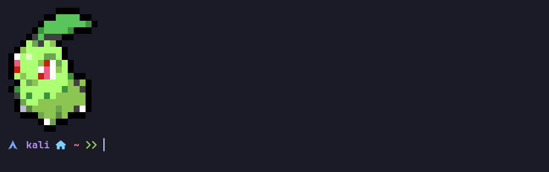
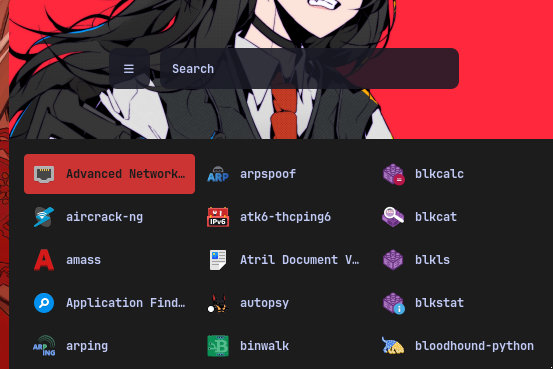

# 🌸 LotusDot (Dotfiles)

*A minimalist BSPWM environment in progress – currently refining the color palette*

### ▶ **Current Stack**
| Component      | Status               | Details                     |
|----------------|----------------------|-----------------------------|
| **WM**         | ✅ Stable           | BSPWM + basic window rules  |
| **Hotkeys**    | ✅ Stable           | sxhkd (custom keybinds)     |
| **Launcher**   | 🟠 Testing          | Rofi (theme WIP)            |
| **Terminal**   | ✅ Stable           | Kitty + Powerlevel10k       |
| **Compositor** | 🟠 Testing          | Picom (simple animations)   |
| **Colors**     | 🔴 In Development   | Palette exploration (pywal) |

## 🖼️ Screenshots Gallery

**Kitty Terminal (No color change yet)**
  

**Rofi Launcher (Test)**

## Roadmap
Dotfiles will be published once:  
- Final color palette is chosen  
- Visual consistency across all components is achieved  
- Base documentation for keybinds is ready  

## Coming Next
- Polybar configuration  
- Rofi-powered screenshot/recording scripts  

---

🌱 *"Clean like a lotus, sharp like a bonsai"*  
📜 **License:** MIT (will apply upon release)
